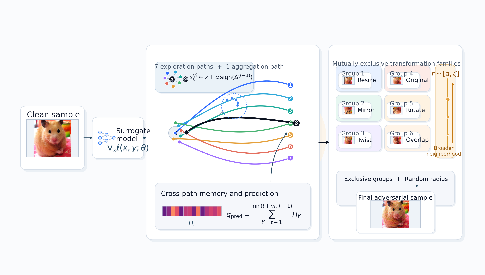

# MGA

Multi-path Gradient Ascent

Deep neural networks are known to be vulnerable to adversarial examples. Among
various attack paradigms, transfer-based attacks are of particular interest due
to their high practicality in black-box scenarios. In this paper, we revisit the
generation of transferable adversarial examples from the perspective of ensemble
learning. We argue that allocating the computational budget across multiple
stochastic optimization paths can effectively reduce gradient redundancy, enlarge
the feature-space distance between clean and adversarial examples, and uncover
more transferable adversarial directions. To this end, we propose Multi-path
Gradient Ascent (MGA), which sequentially coordinates multiple optimization
trajectories under a fixed sampling budget. To ensure sufficient exploration
diversity within the highly non-convex loss landscape, MGA incorporates a
starting-point reset mechanism to spatially disperse the initialization of each path. Furthermore, a cross-path gradient prediction mechanism is introduced
to leverage historical trajectory data, providing a look-ahead correction for
subsequent updates. Building upon this framework, we further propose Multi-path
Input Transformation (MIT) by integrating an intra-family mutually exclusive
transformation sampling mechanism. Experiments on ImageNet show that our
methods improve the transfer success rates across diverse network architectures
and a variety of robust defense models.



## Usage

### Installation

* Python >= 3.13
* PyTorch >= 1.21
* Torchvision >= 0.13.1
* timm >= 0.6.12

```bash
pip install -r requirements.txt
```

### Import clean examples

Building on previous work, we randomly selected 1,000 images from the ImageNet validation set for our experiments. All the images can be correctly classified. You can also construct your own sample set according to the following format. You can also download our prepared dataset and the generated adversarial examples from [Google Drive](https://drive.google.com/drive/folders/10HtEwKffUBQXj9SDZqZvxyFj4yk0gE_u?usp=drive_link).

```text
dataset
├─images
│  ├─ILSVRC2012_val_00000019.png
│  ├─...
│  └─ILSVRC2012_val_00049962.png
└─labels
```

```text
ImageId,TrueLabel
ILSVRC2012_val_00018317.png,0
...
ILSVRC2012_val_00041747.png,999
```

### Generate adversarial examples


```bash
python main.py --input_dir ./dataset/images --input_csv ./dataset/labels
```

or simply

```bash
python main.py
```

if you put the data under the same directory and use the default settings.

### Run for Evaluation

```bash
python evel.py
```

You can perform evaluations of other models by modifying eval.py

## Credits

This repository is modified from [TransferAttack](https://github.com/Trustworthy-AI-Group/TransferAttack?tab=readme-ov-file). Great, thank you!
Downloading the source code of [ResPA](https://github.com/ZezeTao/ResPA). Great, thank you!

## About

If you find any problems with our research or articles, or if you have any questions, you can also contact us at our email: 18359472197@163.com or zqian4120@gmail.com
